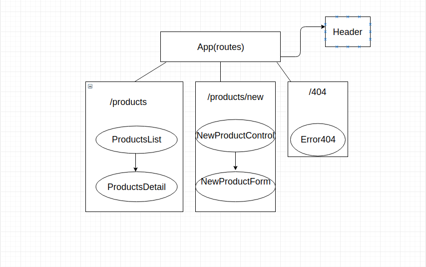

# Ecommerce-React-UI

By Excellent1212

## Description

- Simple React UI for generic ecommer site without Redux

## Setup/Installation Requirements

- Clone the project.
- To install dependencies, `npm install`
- To run the project, `npm start`
- To Build production, `npm run build`
- This project is working with json server, if your port 8080 is unavailable, please change to other ports in package.json at `"start": "react-scripts start & json-server --watch store.json --port 8080",` 
- Json server will be live at `http://localhost:8080/`
- If there were errors while installing json server, try to upgrade npm to latest version with ``npm install -g npm@latest``

## Structure

- The create component is not done yet, but added searach and category components

## Notes

- At the first begining I tried to use material-UI, it ended up a bit hard to make all styles work as expected, and some sytax come with it dosen't work well, disturcturing for example, then I restarted with react-matarialize with create-react-app in order to make all new syntax work.

- At some point, I accidently git inited at src and the root folder, when I switch to root folder, there was a submodule warning, then I simply deleted the .git in src folder. I ended up not many commits.

- Refactored seach components to lift searchText and category state on refactor branch, but not working well

## Known Bugs

- The SearchResults components can not display at the right spot which is below the header

## Technologies focused

- Javascript
- React
- Webpack
- SCSS
- Babel
- react-materialize
- json-server
